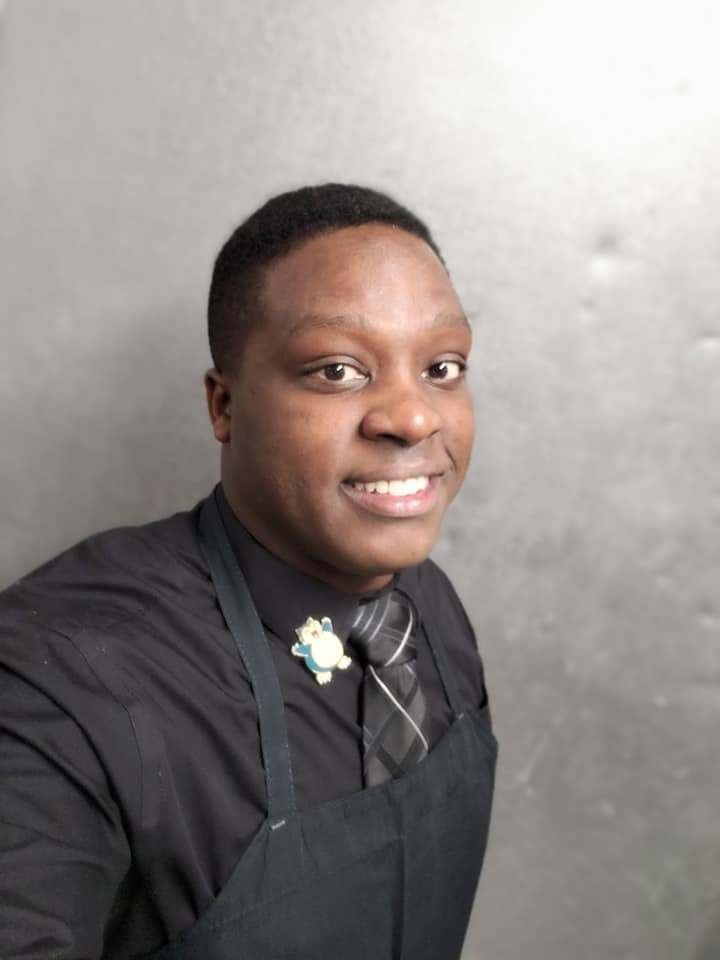

# Welcome to Our Team Portfolio

We are a team of developers working on a CS 410 project focused on improving voter turnout through a mobile voting application.

## Team Members

### Ivan Gunn
**Backend Developer**

 

I’m a senior pursuing a Bachelor of Science in Computer Science. I work as a data center technician at Old Dominion University, maintaining a safe, secure, and scalable server-cloud infrastructure. I perform software and hardware troubleshooting while maintaining clear and concise ticket-based record-keeping. Previously, I managed a team of 40 in the service industry and spend my free time honing my craft by programming personal software projects. I’m proficient in C#, C++, Java, Python, and ActionScript.
  

## Our Projects
### Feasibility Project
We are working on a feasibility study for a mobile voting application designed to streamline the voting process and increase participation, especially among younger voters.

### Presentations

[View Our Presentation](https://docs.google.com/presentation/d/1xyxDIY2hRbmpUhr3_ZPm6VhGi0TFvAYCBhxWS-fQ25g/edit?usp=sharing)

## Contact Us
For inquiries, reach out to:  
- **Ivan Gunn:** Email: igunn001@odu.edu
